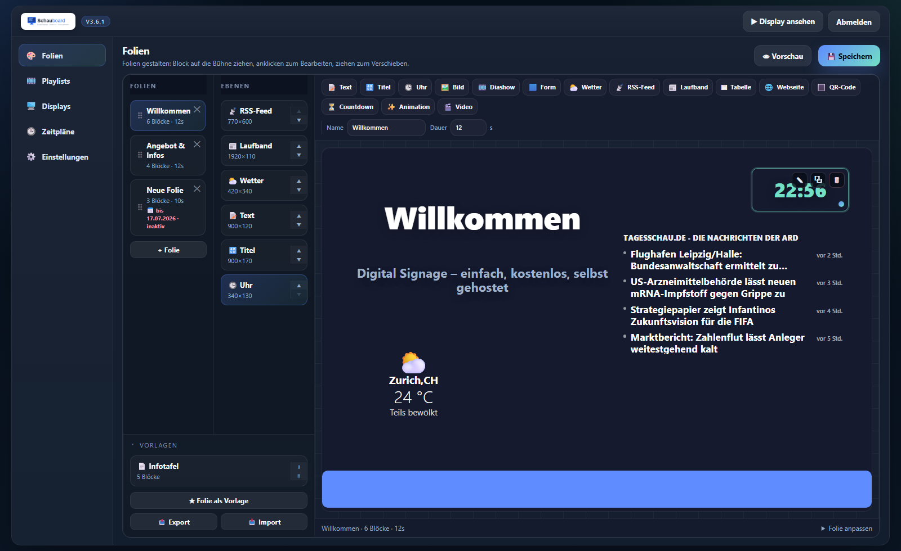
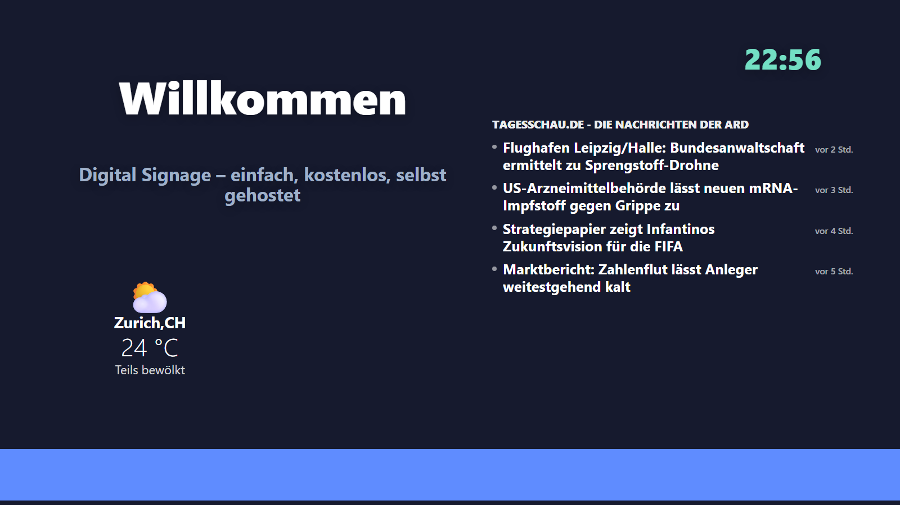

# Schauboard

**Free, self-hosted digital signage. No cloud, no database, no Docker.**

Turn any screen into an information display — welcome boards, menus, opening hours, announcements,
dashboards. Copy the files onto a NAS, a Raspberry Pi or any web space with PHP, open the browser,
done. Your content never leaves your server.

*[Deutsche Version: README.de.md](README.de.md)*



## Why another signage tool?

Most self-hosted signage needs Docker, a database, a message broker — or all three. Schauboard needs
**PHP and a folder**. Content lives in plain JSON files you can back up by copying a directory.

- **No database.** Content is JSON on disk, written atomically with rotating backups.
- **No cloud, no account, no telemetry.** Displays only ever talk to your own server.
- **No build step.** Plain PHP and vanilla JavaScript — edit a file, reload the page.
- **English and German**, switchable in the settings.
- **Runs where you already have PHP.** Synology Web Station, a Pi, shared hosting, XAMPP.
- **One editor, one renderer.** The editor preview and the TV use the exact same rendering code,
  so what you design is what you get.

## Modules

Fifteen block types, freely placeable on a 1920×1080 canvas:

| | | |
|---|---|---|
| 📝 Text | 🔠 Heading | 🕒 Clock |
| 🖼️ Image | 🎞️ Slideshow | 🟦 Shape |
| ⛅ Weather (live, optional 3-day forecast) | 📡 RSS/Atom feed | 📰 Ticker |
| ▦ Table (paste straight from Excel) | 🌐 Web page | 🔳 QR code |
| ⏳ Countdown | ✨ HTML/CSS animation (sandboxed) | 🎬 Video (file, URL or YouTube) |

## Features

- **Multi-display** — one URL per screen (`/?display=name`), assign a playlist per screen,
  online status via heartbeat, QR code to open the URL on a TV stick.
- **Playlists** — drag slides into the order they should appear.
- **Scheduling** — show a different playlist by time of day and weekday (windows across midnight
  are supported), plus an optional **valid-from / valid-until date per slide** for holidays and
  seasonal content.
- **Live reload** — displays poll a lightweight revision endpoint and refresh themselves within
  seconds of you hitting save. No restart, no touching the TV.
- **Templates, import/export, full backup** — reuse slides, move an installation to a new server.
- **One-click updates** — checks a signed manifest, verifies the SHA-256 of the package, backs up
  the old files and rolls back automatically if anything fails. `data/`, `uploads/` and your local
  config are never touched.
- **Maintenance mode** — show a notice on every screen while you rearrange things.



## Quick start

```bash
php -S 127.0.0.1:8080 -t schauboard-v3
```

- **Editor:** <http://127.0.0.1:8080/admin/> — you set the admin password on first visit.
- **Display:** <http://127.0.0.1:8080/?display=default>

To install it for real, copy the contents of `schauboard-v3/` into your web root. On a TV, open the
display URL in the browser's fullscreen/kiosk mode.

### Requirements

- **PHP 8.0 or newer** (developed and tested on 8.2–8.5)
- `allow_url_fopen=On` for the weather and RSS modules (both are server-side proxies with caching)
- Write access for PHP to `data/` and `uploads/`
- The PHP `zip` extension if you want the one-click updater (otherwise you get a guided manual download)

### Keep `data/` private

It holds your content and the password hash. On **Apache** a protective `data/.htaccess`
(`Require all denied`) is created automatically. On **nginx**, add:

```nginx
location ^~ /data/ { deny all; return 404; }
```

## How it works

```
schauboard-v3/
  index.php           → loads display/index.php (the public screen)
  assets/
    blocks.css        shared block styling
    blocks.js         shared render engine + live behaviour (clock, weather, RSS, ticker, …)
    display.js        slideshow controller (rotation, transitions, heartbeat, live reload)
  core/
    Config.php        configuration (config.local.php overrides everything)
    Storage.php       atomic writes, rotating backups, revision signature
    Auth.php          bcrypt password in a file, session login
    Sanitizer.php     validates and cleans every input before it is stored
    Updater.php       update check + in-app update with verification and rollback
  admin/              the editor (index.php + editor.js.php)
  display/index.php   resolves display → playlist → slides, renders via the shared engine
  api/                small JSON endpoints (slides, playlists, displays, schedules, settings,
                      upload, preview, weather, rss, heartbeat, revision, backup, update)
  data/               your content as JSON (not in this repo)
  uploads/            your uploaded media (not in this repo)
```

The interesting bit is `assets/blocks.js`: every block type is rendered there exactly once, and both
the admin canvas and the TV call into it. That is why the preview cannot drift from the real output.

## Security notes

- The admin password is stored as a bcrypt hash in `data/admin_password.php`, never in plain text.
  Forgot it? Delete that file and the setup screen comes back.
- **Set the password immediately after installing.** Until you do, anyone who can reach `/admin/`
  can claim the instance. Ideally do the first run before exposing the server to a network.
- Sessions regenerate their ID on login; the cookie is HttpOnly and SameSite=Lax.
- The weather and RSS proxies refuse loopback and link-local targets and follow redirects only
  after re-checking each hop. RSS is not an open proxy: without an admin session it will only fetch
  feed URLs that actually appear in a saved slide.
- HTML/CSS animation blocks run inside a sandboxed iframe without same-origin access.

## Good to know

- **Available in English and German.** Switch under *Settings → Language*; the display side,
  server messages and weather conditions follow the same setting. German is kept as the fallback
  for every string, so a missing translation shows German rather than an empty label. Adding
  another language means dropping a `lang/<code>.php` next to `lang/en.php`.
- Displays never phone home. The only outbound request is the update check against the project
  website, and you can switch it off in `config.local.php`:
  ```php
  <?php return ['update_check_enabled' => false];
  ```
- The QR code module renders via an external generator service, so QR blocks need internet access
  on the display. Everything else works fully offline (weather and RSS obviously need a connection
  on the *server* side).

## Documentation

- [docs/TESTING.md](schauboard-v3/docs/TESTING.md) — acceptance checklist
- [Handbook (German, PDF)](https://schauboard.ch/dl/doku/signage-doku.pdf)
- Project website: [schauboard.ch](https://schauboard.ch)

## License

Licensed under the [Apache License 2.0](LICENSE) — free to use, modify and distribute,
including commercially. See [NOTICE](NOTICE) for attribution.
